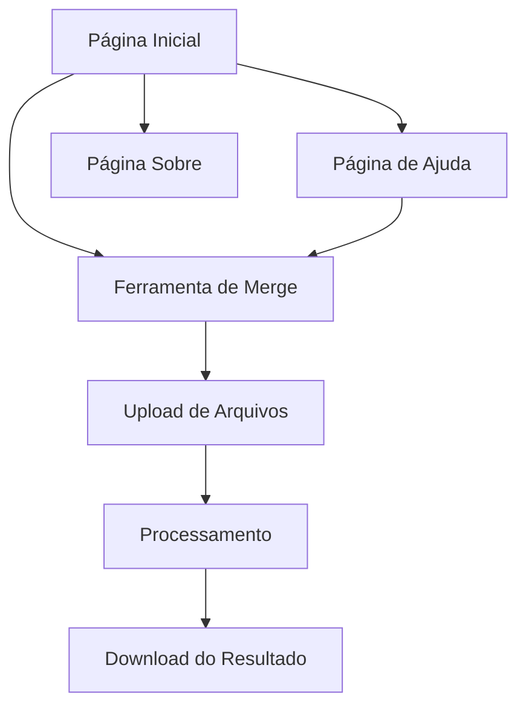

# Sistema Web de Ferramentas XML/Meta

## 1. Visão Geral do Produto

Um sistema web moderno e elegante para processamento de arquivos XML/Meta, inicialmente focado na funcionalidade de merge (unificação) de arquivos, com arquitetura preparada para futuras expansões como separação, remoção e reordenação de dados.

* O sistema resolve o problema de processamento manual de arquivos XML/Meta, oferecendo uma interface web intuitiva para desenvolvedores e usuários técnicos.

* Objetivo: democratizar o acesso a ferramentas de manipulação de arquivos XML/Meta através de uma plataforma web acessível e gratuita.

## 2. Funcionalidades Principais

### 2.1 Papéis de Usuário

| Papel          | Método de Acesso           | Permissões Principais                                     |
| -------------- | -------------------------- | --------------------------------------------------------- |
| Usuário Padrão | Acesso direto sem registro | Pode fazer upload, processar arquivos e baixar resultados |

### 2.2 Módulo de Funcionalidades

Nossos requisitos do sistema consistem nas seguintes páginas principais:

1. **Página Inicial**: seção hero, navegação, apresentação das ferramentas disponíveis
2. **Ferramenta de Merge**: upload de arquivos, processamento, download do resultado
3. **Página de Ajuda**: documentação, exemplos de uso, FAQ
4. **Página Sobre**: informações do projeto, contato, créditos

### 2.3 Detalhes das Páginas

| Nome da Página      | Nome do Módulo          | Descrição da Funcionalidade                                                                     |
| ------------------- | ----------------------- | ----------------------------------------------------------------------------------------------- |
| Página Inicial      | Seção Hero              | Apresentar o sistema com design moderno, título impactante e call-to-action para as ferramentas |
| Página Inicial      | Menu de Navegação       | Navegação responsiva com links para todas as seções e ferramentas                               |
| Página Inicial      | Showcase de Ferramentas | Cards elegantes apresentando cada ferramenta disponível com ícones e descrições                 |
| Ferramenta de Merge | Área de Upload          | Drag & drop para múltiplos arquivos XML/Meta com validação de formato                           |
| Ferramenta de Merge | Processamento           | Executar merge dos arquivos usando a lógica existente, com feedback visual de progresso         |
| Ferramenta de Merge | Download de Resultado   | Botão para baixar arquivo unificado com nome personalizado                                      |
| Ferramenta de Merge | Histórico de Operações  | Lista das últimas operações realizadas na sessão atual                                          |
| Página de Ajuda     | Documentação            | Guias passo-a-passo sobre como usar cada ferramenta                                             |
| Página de Ajuda     | Exemplos Práticos       | Casos de uso comuns com arquivos de exemplo para download                                       |
| Página de Ajuda     | FAQ                     | Perguntas frequentes sobre formatos suportados e limitações                                     |
| Página Sobre        | Informações do Projeto  | Descrição técnica, tecnologias utilizadas, roadmap futuro                                       |

## 3. Processo Principal

**Fluxo do Usuário Principal:**

1. Usuário acessa a página inicial e visualiza as ferramentas disponíveis
2. Clica na ferramenta de Merge XML/Meta
3. Faz upload de múltiplos arquivos XML/Meta via drag & drop
4. Sistema valida os arquivos e exibe preview dos dados
5. Usuário confirma a operação de merge
6. Sistema processa os arquivos e gera arquivo unificado
7. Usuário baixa o resultado final

## 4. Design da Interface do Usuário

### 4.1 Estilo de Design

* **Cores Primárias**: Azul moderno (#3B82F6) e cinza escuro (#1F2937)

* **Cores Secundárias**: Verde para sucesso (#10B981), vermelho para erros (#EF4444)

* **Estilo de Botões**: Arredondados com sombras suaves, efeitos hover elegantes

* **Fonte**: Inter ou similar, tamanhos 14px (corpo), 18px (subtítulos), 32px (títulos)

* **Layout**: Design card-based com espaçamento generoso, navegação superior fixa

* **Ícones**: Heroicons ou Lucide para consistência visual

### 4.2 Visão Geral do Design das Páginas

| Nome da Página      | Nome do Módulo          | Elementos da UI                                                                        |
| ------------------- | ----------------------- | -------------------------------------------------------------------------------------- |
| Página Inicial      | Seção Hero              | Gradiente de fundo azul, título em branco grande, botão CTA com animação hover         |
| Página Inicial      | Showcase de Ferramentas | Grid responsivo de cards com ícones coloridos, sombras suaves, hover effects           |
| Ferramenta de Merge | Área de Upload          | Zona de drop com borda tracejada, ícone de upload, lista de arquivos com progress bars |
| Ferramenta de Merge | Processamento           | Spinner animado, barra de progresso, mensagens de status em tempo real                 |
| Página de Ajuda     | Documentação            | Layout de duas colunas, sidebar com navegação, conteúdo com syntax highlighting        |
| Página Sobre        | Informações             | Cards com informações técnicas, timeline do roadmap, links                             |

