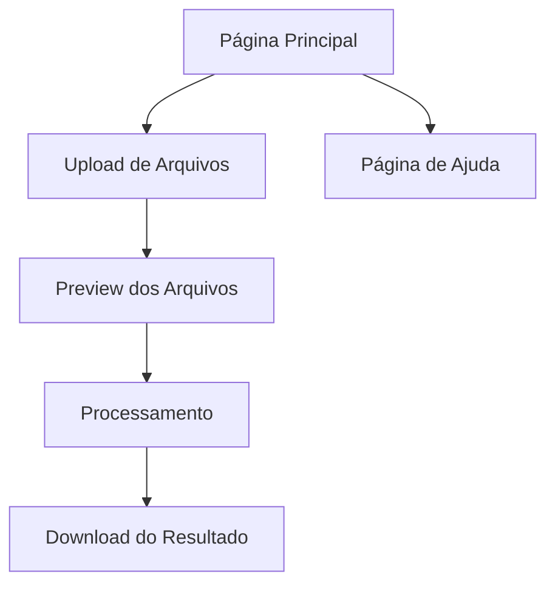

## 1. Product Overview
Sistema web para unificação de arquivos XML de veículos do GTA V, permitindo upload de múltiplos arquivos .meta e gerando um arquivo unificado com interface moderna e intuitiva.

O produto resolve o problema de unificar manualmente arquivos XML de veículos, oferecendo uma interface web elegante para usuários que trabalham com modding de GTA V.

## 2. Core Features

### 2.1 User Roles
Não há distinção de papéis - todos os usuários têm acesso completo às funcionalidades.

### 2.2 Feature Module
Nosso sistema de unificação de XML consiste nas seguintes páginas principais:
1. **Página Principal**: área de upload, processamento e download de arquivos XML
2. **Página de Ajuda**: instruções de uso e informações sobre o formato de arquivos

### 2.3 Page Details

| Page Name | Module Name | Feature description |
|-----------|-------------|---------------------|
| Página Principal | Área de Upload | Upload múltiplo de arquivos XML (.meta), validação de formato, preview dos arquivos selecionados |
| Página Principal | Processador XML | Conversão XML para JSON, unificação de dados (InitDatas e txdRelationships), geração do arquivo final |
| Página Principal | Download Manager | Download automático do arquivo unificado, histórico de processamentos |
| Página Principal | Status Monitor | Indicadores de progresso, logs de processamento, tratamento de erros |
| Página de Ajuda | Documentação | Instruções de uso, exemplos de arquivos, troubleshooting |

## 3. Core Process

Fluxo principal do usuário:
1. Acessa a página principal
2. Faz upload de múltiplos arquivos XML (.meta)
3. Visualiza preview dos arquivos carregados
4. Clica em "Unificar Arquivos"
5. Acompanha o progresso do processamento
6. Faz download do arquivo unificado gerado
7. Pode acessar a página de ajuda para instruções adicionais

## 4. User Interface Design

### 4.1 Design Style
- **Cores primárias**: Azul (#3B82F6) e Verde (#10B981) para ações positivas
- **Cores secundárias**: Cinza (#6B7280) e Branco (#FFFFFF)
- **Estilo de botões**: Arredondados com sombras suaves
- **Tipografia**: Inter ou similar, tamanhos 14px-24px
- **Layout**: Card-based com navegação superior
- **Ícones**: Lucide ou Heroicons para consistência

### 4.2 Page Design Overview

| Page Name | Module Name | UI Elements |
|-----------|-------------|-------------|
| Página Principal | Área de Upload | Drag & drop zone com bordas tracejadas, ícone de upload, lista de arquivos com preview |
| Página Principal | Processador | Botão principal destacado, barra de progresso animada, logs em tempo real |
| Página Principal | Download | Botão de download com ícone, card com informações do arquivo gerado |
| Página de Ajuda | Documentação | Cards informativos, código de exemplo, FAQ expandível |

### 4.3 Responsiveness
Desktop-first com adaptação mobile, otimizado para touch em dispositivos móveis.